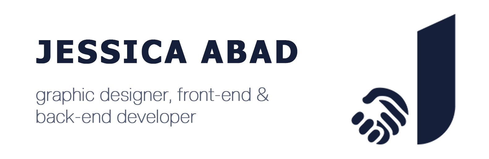
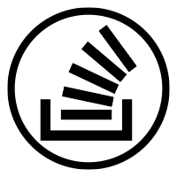
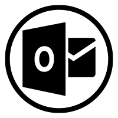

<!--
**abadJessica/abadJessica** is a ✨ _special_ ✨ repository because its `README.md` (this file) appears on your GitHub profile.
-->
### Hi there 👋 ! 

### 📫 Let's connect!

### A little about me...
I am a current web developer student at Humber College, always learning and building, one line of code at a time. I believe that good communication and a positive attitude are just as important as the code itself. 

**_From idea to code, every line tells a story._**

